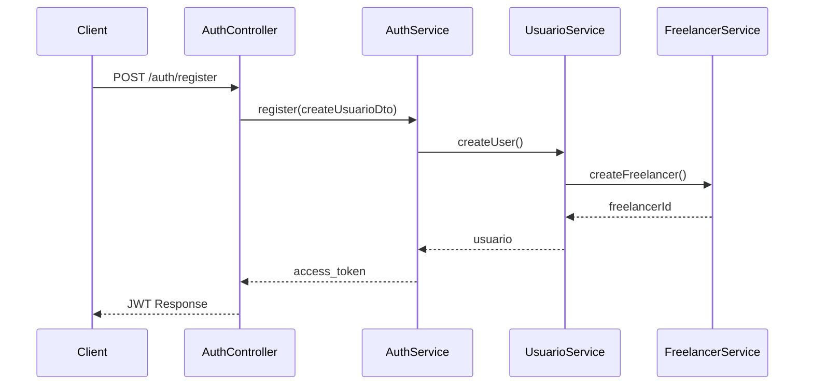

#          

---

# Arquiteturas e Metodologias de Desenvolvimento: Guia Abrangente

Antes de mergulharmos nos detalhes, é importante entender que estas arquiteturas e metodologias são ferramentas no
arsenal de um desenvolvedor - não são soluções universais, mas abordagens que resolvem problemas específicos em
contextos específicos.

## Arquitetura Hexagonal e Clean Architecture

### Propósito e Conceitos

A **Arquitetura Hexagonal** (também conhecida como Ports and Adapters) e a **Clean Architecture** são abordagens
arquiteturais que compartilham um objetivo comum: isolar o domínio da aplicação (regras de negócio) das dependências
externas[^1_4].

Clean Architecture é um padrão arquitetural domain-centric que estabelece componentes lógicos com interações bem
definidas entre si[^1_7]. Esta arquitetura coloca as regras de negócio no centro e organiza as dependências de forma que
fluam de fora para dentro.

### Quando Usar

- Quando você precisa de flexibilidade para trocar implementações sem afetar o núcleo do sistema
- Para aplicações complexas onde a manutenibilidade é crucial
- Quando deseja prevenir o vendor lock-in (dependência excessiva de tecnologias específicas)[^1_4]
- Para permitir que o domínio seja desenvolvido e testado independentemente

### Aplicação Prática

Na implementação prática, estas arquiteturas envolvem:

- Separação de camadas (domínio, aplicação, infraestrutura)
- Uso de interfaces para definir "portas" de comunicação
- Inversão de dependência (o domínio não conhece implementações externas)

```
"Arquitetura hexagonal não são boas práticas, e sim apenas estilos arquiteturais para você organizar o código da aplicação."[^1_18]
```

## Domain-Driven Design (DDD)

### Propósito e Conceitos

DDD é uma abordagem de desenvolvimento que foca no domínio do negócio e suas regras. O objetivo é criar um modelo de
software que reflita com precisão os conceitos do mundo real do domínio[^1_3].

### Quando Usar

- Para sistemas com domínios complexos
- Quando há necessidade de comunicação eficaz entre desenvolvedores e especialistas do domínio
- Em projetos onde o valor está nas regras de negócio sofisticadas, não apenas em CRUD

### Elementos Chave

- **Linguagem Ubíqua**: Vocabulário compartilhado entre desenvolvedores e especialistas do domínio
- **Bounded Contexts**: Delimitações explícitas onde um modelo específico se aplica
- **Entidades, Agregados e Value Objects**: Padrões para modelar o domínio

## Microserviços

### Propósito e Conceitos

Microserviços é uma arquitetura que divide uma aplicação em serviços pequenos, independentes e focados em uma única
responsabilidade[^1_3]. Estes serviços se comunicam entre si através de APIs bem definidas.

### Quando Usar

- Para sistemas grandes e complexos que precisam escalar independentemente em diferentes componentes
- Quando equipes diferentes precisam trabalhar em partes separadas do sistema
- Para permitir implantações independentes e tecnologias heterogêneas

### Comunicação entre Microserviços

Existem dois padrões principais de comunicação[^1_9]:

- **Síncrona**: Um serviço chama outro diretamente (via HTTP/REST, gRPC) e espera pela resposta
- **Assíncrona**: Comunicação via mensagens ou eventos (Kafka, RabbitMQ), permitindo desacoplamento temporal

## NestJS como Framework para Microserviços

### Propósito e Conceitos

NestJS é um framework para JavaScript/TypeScript criado em 2017 que facilita a construção de aplicações web e
microserviços[^1_1]. Ele oferece suporte para:

- Modularidade
- Injeção de dependência
- Comunicação entre serviços
- Integração com bancos de dados e mensageria

### Quando Usar

- Para desenvolver microserviços em JavaScript/TypeScript
- Quando você precisa de uma estrutura organizada para aplicações Node.js
- Para equipes que valorizam princípios de design orientado a objetos

```
"Nest é um Framework que roda em cima de Node.js, então desenvolvemos com JavaScript/TypeScript para construir aplicações web que funcionam com bancos de dados e fazem várias outras coisas."[^1_1]
```

## SOLID e Clean Code

### Propósito e Conceitos

SOLID é um conjunto de cinco princípios de design orientado a objetos que visam criar código mais manutenível e
extensível. Clean Code se refere a práticas para escrever código legível e bem estruturado.

### Quando Usar

- Como diretrizes constantes durante o desenvolvimento
- Especialmente útil após os primeiros meses de experiência com programação[^1_8]
- Quando você está refatorando código existente

### Aplicação Prática

```
"Código Limpo não é pra quem está começando... Num primeiro momento vale aprender mais sobre algoritmos. O livro do código limpo é ótimo, mas se você tiver bem no começo vão ter vários conceitos que vão ficar confusos."[^1_20]
```

## Test-Driven Development (TDD)

### Propósito e Conceitos

TDD é uma metodologia onde você escreve testes automatizados antes de escrever o código de produção, seguindo o ciclo:
escrever teste, ver o teste falhar, implementar o código mínimo para passar no teste, refatorar.

### Quando Usar

- Para código crítico que precisa ser confiável
- Em equipes experientes com cultura de testes
- Quando os requisitos estão bem definidos

### Percepção do Mercado

```
"Tdd usa quem quer, eu não conheço ninguém que use e não recomendaria ninguém a usar tb"[^1_18]
```

## Segurança em Contêineres Docker

### Propósito e Conceitos

Práticas para criar contêineres Docker seguros, especialmente para aplicações Java[^1_11], incluindo:

- Escolher a imagem base correta
- Aplicar o princípio do menor privilégio
- Builds multi-estágio para reduzir o tamanho e a superfície de ataque
- Análise de vulnerabilidades em contêineres

### Quando Usar

- Em qualquer implantação de produção usando contêineres
- Como parte do pipeline CI/CD
- Quando a segurança é um requisito não-funcional crítico

## Combinações Efetivas para Diferentes Cenários

### Para Aplicações Corporativas Complexas

- DDD para modelar o domínio complexo
- Arquitetura Hexagonal/Clean para organizar o código
- Microserviços para escala e desenvolvimento independente
- SOLID e Clean Code como diretrizes constantes
- Testes automatizados (não necessariamente TDD)

### Para Startups e MVPs

- Abordagem mais pragmática e simplificada
- Foco em entregas rápidas com qualidade suficiente
- Princípios de Clean Code básicos
- Possivelmente monolito com design modular (pensando em futura evolução)

### Para Sistemas Críticos

- TDD para garantir alta confiabilidade
- Arquitetura Hexagonal para testabilidade
- DDD para capturar corretamente regras de negócio complexas
- Práticas rigorosas de segurança em todas as etapas

## Considerações Práticas

É importante notar o contraste entre a teoria e a prática no mercado real:

```
"Raro são os lugares que implementam DDD ou mesmo clean arch legal. Galera lê uns artigos e implementa umas abstrações inúteis que não fazem nada além de passar um objeto de um lado para o outro."[^1_18]
```

```
"Muita camada de abstração desnecessária que deixava a entrega muito lenta além de ser chato pra caralho de fazer qualquer mudança no sistema."[^1_18]
```

A chave parece ser encontrar o equilíbrio certo para cada contexto:

1. **Avalie a complexidade do domínio** - Para sistemas simples, abordagens mais diretas podem ser suficientes
2. **Considere a maturidade da equipe** - Arquiteturas complexas exigem experiência e disciplina
3. **Pense no ciclo de vida do produto** - Um MVP pode precisar de uma abordagem diferente de um sistema de longa
   duração
4. **Adapte as práticas ao seu contexto** - Não siga dogmaticamente padrões arquiteturais; extraia o que faz sentido

## Conclusão

Estas arquiteturas e metodologias são ferramentas valiosas quando aplicadas adequadamente. O verdadeiro desafio é saber
quando e como utilizá-las para maximizar o valor sem introduzir complexidade desnecessária.

Para desenvolvedores iniciantes, recomenda-se começar com algoritmos e estruturas de dados fundamentais, depois avançar
para Clean Code, e só então mergulhar nas arquiteturas mais complexas como Clean Architecture e DDD.

A mensagem final é que não existe bala de prata - o melhor conjunto de práticas é aquele que atende aos requisitos
específicos do seu sistema e da sua equipe, equilibrando qualidade, tempo de desenvolvimento e manutenibilidade a longo
prazo.

<div style="text-align: center">⁂</div>

[^1_1]: https://www.youtube.com/watch?v=y4CayhdrSOY

[^1_2]: https://www.youtube.com/watch

[^1_3]: https://www.youtube.com/watch?v=Oxwc_RtGga0

[^1_4]: https://www.youtube.com/watch?v=JgEDHYrhZwQ

[^1_5]: https://www.youtube.com/watch?v=H9oSJuc06vg

[^1_6]: https://www.youtube.com/watch?v=nplOLS9hmKk

[^1_7]: https://www.youtube.com/watch?v=1OLSE6tX71Y

[^1_8]: https://www.youtube.com/watch?v=Vyb9w8lOGOI

[^1_9]: https://www.youtube.com/watch?v=kgRMPN96Lns

[^1_10]: https://www.youtube.com/watch?v=eMdgsKQ_ut0

[^1_11]: https://www.youtube.com/watch?v=rLSKDzOpVNQ

[^1_12]: https://www.semanticscholar.org/paper/5e8271bd3ce1fd38515812cdab3cb47909284008

[^1_13]: https://www.semanticscholar.org/paper/64b21a9912c1bfa4685f3d796e862d1b6c51b926

[^1_14]: https://www.semanticscholar.org/paper/132881ef224da6b27e5be4ce33d28f3d790bb05f

[^1_15]: https://www.semanticscholar.org/paper/21bc128a28d8d4770e7a9c111a4687fea8edf0c4

[^1_16]: https://www.semanticscholar.org/paper/74f8f0e47139b647941d575a62f34b9f5d926a02

[^1_17]: https://www.semanticscholar.org/paper/51bc7789f5da1f33cf244c818eda498b59c7967b

[^1_18]: https://www.reddit.com/r/brdev/comments/15xs1go/no_lugar_que_vocês_trabalham_usam_clean_arch_ddd/

[^1_19]: https://www.reddit.com/r/brdev/comments/1dc955q/como_vocês_melhoraram_a_qualidade_do_código_de/

[^1_20]: https://www.reddit.com/r/brdev/comments/17h3luk/por_qual_eu_começo_e_outros_títulos_pra_quem_tá/

[^1_21]: https://www.reddit.com/r/brdev/comments/1dcm8hz/galera_parém_de_recomendar_o_livro_clean_code_é/

[^1_22]: https://aprendagolang.com.br/o-que-e-arquitetura-hexagonal/

[^1_23]: https://apibrasil.blog/desenvolvimento-de-microservicos-com-docker-e-kubernetes/

[^1_24]: https://www.dio.me/articles/desvendando-nextjs-e-nestjs-a-combinacao-perfeita-para-aplicacoes-full-stack-de-alto-desempenho

[^1_25]: https://www.dio.me/articles/clean-code-a-base-solida-para-arquitetura-de-sistemas

[^1_26]: https://descomplica.com.br/blog/arranjo-combinacao-e-permutacoes/

[^1_27]: https://pt.linkedin.com/pulse/explorando-arquitetura-hexagonal-conceitos-objetivos-prática-rocha-nphff

[^1_28]: https://www.semanticscholar.org/paper/7bb029345bf9bfb18e3373127bb372516d51d327

[^1_29]: https://www.semanticscholar.org/paper/2fa04ce315886f9388f35ae67a488cf2fe5b4b68

[^1_30]: https://www.semanticscholar.org/paper/a28a89f17c9bf400670a58d39b10481fc315c8c9

[^1_31]: https://www.semanticscholar.org/paper/1bc963fe5fc051109fb98cecbed70a08ea9d2365

[^1_32]: https://www.semanticscholar.org/paper/8ef43b6704f87799f3ddd6db7df949bc5020aa52

[^1_33]: https://www.semanticscholar.org/paper/6ec03bdc4022ad7f94acf413dffcb8f5ba113cda

[^1_34]: https://www.reddit.com/r/brdev/comments/1j6lco0/programadores_java_o_que_se_espera_de_um_junior/

[^1_35]: https://github.com/cod3rcursos/arq-hexagonal-simplificada

[^1_36]: https://dotnet.microsoft.com/pt-br/learn/aspnet/microservice-tutorial/intro

[^1_37]: https://dev.to/yakovlev_alexey/creating-a-project-with-nestjs-nextjs-3i1i

[^1_38]: https://balta.io/blog/clean-code

[^1_39]: https://www.rocaceramica.com.br/blog/mix-and-match/

[^1_40]: https://www.arqpedia.com.br/post/desvendando-a-beleza-e-eficiência-da-arquitetura-hexagonal-uma-abordagem-contemporânea

[^1_41]: https://www.semanticscholar.org/paper/6324f8c6672424aa4b94e8ea685566d07136047f

[^1_42]: https://www.semanticscholar.org/paper/75fa8c9a6058585aa998f33dff9cec4841811f57

[^1_43]: https://www.semanticscholar.org/paper/08bdb2d6ca25298a62257c2082a0a6beebd05a3c

[^1_44]: https://www.semanticscholar.org/paper/998b786fcf9233b250637fe64cb30db8e0fb448a

[^1_45]: https://www.semanticscholar.org/paper/c598ae87888622f7b88666e8238ed7699ed8e449

[^1_46]: https://www.semanticscholar.org/paper/b35c107cc1464920fb6e919d25b2318888e2a6a2

[^1_47]: https://www.reddit.com/r/softwarearchitecture/comments/1f75l7r/is_it_efficient_to_orchestrate_a_modular_monolith/

[^1_48]: https://www.reddit.com/r/Nestjs_framework/comments/w6psk4/how_to_integrate_nextjs_with_nestjs/

[^1_49]: https://www.reddit.com/r/docker/comments/15d1dcv/how_does_microservice_architecture_handle_common/

[^1_50]: https://www.reddit.com/r/ExperiencedDevs/comments/1d89gcw/hexagonal_architecture_multiple_deployments_in_a/

[^1_51]: https://www.reddit.com/r/nextjs/comments/1f1ozia/combining_nextjs_with_a_separate_nestjs_backend_a/

[^1_52]: https://www.reddit.com/r/dotnet/comments/o68y59/yet_another_net_clean_architecture_but_for/

[^1_53]: https://stackoverflow.com/questions/54697026/hexagonal-architecture-and-microservices-how-do-they-fit-together

[^1_54]: https://github.com/kyle-mccarthy/nest-next

[^1_55]: https://github.com/rahulsahay19/eShopping

[^1_56]: https://www.linkedin.com/pulse/harnessing-hexagonal-architecture-microservices-modern-ahmed-al-sharu-vtp6f

[^1_57]: https://www.youtube.com/watch?v=Y9KNU2MnO-o

[^1_58]: https://www.youtube.com/watch?v=QPSqF5OqdSw

[^1_59]: https://www.semanticscholar.org/paper/51dc97027047d13bdff9c6c49c814f7fc6d275c7

[^1_60]: https://www.semanticscholar.org/paper/da94bc8f5db3b1332c7f1321d6aed30669f0527b

[^1_61]: https://www.semanticscholar.org/paper/70554cd6795f7593b4516438612f260563c70ee5

[^1_62]: https://www.semanticscholar.org/paper/384c62b1f63c48d116dae7caea1a3df3ed61f533

[^1_63]: https://www.semanticscholar.org/paper/0159543ebe367491b31582c7b4d40547628f17d8

[^1_64]: https://www.semanticscholar.org/paper/f0d792fee40dc21976b85f83fae864203e978d2f

[^1_65]: https://www.reddit.com/r/dotnet/comments/1j7jtaa/how_would_you_scale_a_simple_application_based_on/

[^1_66]: https://www.reddit.com/r/ExperiencedDevs/comments/1czt58j/ntier_vs_uncle_bobs_clean_architecture_for/

[^1_67]: https://www.reddit.com/r/dotnet/comments/nxohar/best_way_to_handle_shared_libraries_for_net/

[^1_68]: https://github.com/viettranx/micro-clean-architecture-service-demo

[^1_69]: https://softwareengineering.stackexchange.com/questions/442339/is-microservices-a-means-of-implementing-clean-architecture-through-technologica

[^1_70]: https://ardalis.com/clean-architecture-sucks/

[^1_71]: https://www.semanticscholar.org/paper/976bb4f7dff4b8e0a414c93dbd84a3f807b43a47

[^1_72]: https://www.semanticscholar.org/paper/b295e3aab05b641fdd2d618a5b0b0354ad5728bf

[^1_73]: https://www.semanticscholar.org/paper/7df31384a342ee4caada488e935c2caa506552b2

[^1_74]: https://www.semanticscholar.org/paper/61957f6acde6e636b4ea43e50296f2d0fefda902

[^1_75]: https://www.semanticscholar.org/paper/0df387b3348b26eeddb47022203a9505e7b6cc2d

[^1_76]: https://www.semanticscholar.org/paper/4d48ff4f6c993963b5386ecc1762996eb2c568bb

[^1_77]: https://www.reddit.com/r/softwarearchitecture/comments/uo236a/how_to_share_code_between_adapters_in_a_hexagonal/

[^1_78]: https://www.reddit.com/r/rust/comments/1dmqqo5/master_hexagonal_architecture_in_rust_parts_1_2/

[^1_79]: https://www.reddit.com/r/golang/comments/1h7jajk/why_clean_architecture_and_overengineered/

[^1_80]: https://github.com/monicaribeiro/arquitetura-hexagonal

[^1_81]: https://scalastic.io/en/hexagonal-architecture/

[^1_82]: https://www.youtube.com/watch?v=0NfqX1RFkBg

[^1_83]: https://dev.to/dyarleniber/hexagonal-architecture-and-clean-architecture-with-examples-48oi

[^1_84]: https://stackoverflow.com/questions/71254799/docker-image-for-multi-maven-modules-hexagonal-architecture

[^1_85]: https://github.com/LauroSilveira/hexagonal-architecture/blob/main/docker-compose.yml

[^1_86]: https://www.semanticscholar.org/paper/5a1babf13419bb95c8f5b3917afe079d4c3ae61c

[^1_87]: https://www.semanticscholar.org/paper/77705a336e1cc931bc8f905acdf814262214ecc6

[^1_88]: https://www.semanticscholar.org/paper/b8af20d592962662f80990ebcf0903ec85be7a6a

[^1_89]: https://www.semanticscholar.org/paper/3dd2ccbcf3ba6cfa55929be73d1bcde4d754824f

[^1_90]: https://www.semanticscholar.org/paper/3dab798c951ab08a8130fea24c2b02ee24e3e6b3

[^1_91]: https://www.semanticscholar.org/paper/110f7dab68329f060111c00bb50577e50ca2e7a2

[^1_92]: https://www.reddit.com/r/nextjs/comments/1h8e73u/fullstack_setup_turborepo_nextjs_nestjs/

[^1_93]: https://www.youtube.com/watch?v=NibJoqxyYNA

[^1_94]: https://www.youtube.com/watch?v=Vf2rykpfgAI

[^1_95]: https://www.semanticscholar.org/paper/aa1f125d1c65f57bb3bcebda460174dbcf028311

[^1_96]: https://www.semanticscholar.org/paper/3c0fc588fb7a97730b98246dc99695e861553364

[^1_97]: https://www.semanticscholar.org/paper/a75a5753f9a949ce87908c950d2b3c2996f382c3

[^1_98]: https://www.semanticscholar.org/paper/0f58ac8cf4c39c846a56e34cc284eab5ca394fe4

[^1_99]: https://www.reddit.com/r/microservices/comments/199px0g/how_does_your_local_development_setup_look_like/?tl=pt-br

[^1_100]: https://www.reddit.com/r/nextjs/comments/13p1275/best_practices_for_integrating_nestjs_with_nextjs/?tl=pt-br

[^1_101]: https://www.reddit.com/r/webdev/comments/1f4fz7v/how_to_communicate_longterm_development_choices/?tl=pt-br

[^1_102]: https://www.reddit.com/r/softwarearchitecture/comments/1hnuref/hexagonal_architecture_across_languages_and/?tl=pt-br

[^1_103]: https://www.reddit.com/r/microservices/comments/1ho4zop/roadmap_and_resources_needed_for_advanced_backend/?tl=pt-br

[^1_104]: https://www.reddit.com/r/node/comments/10ij9hg/is_the_combination_of_nestjs_and_nextjs_is/?tl=pt-br

[^1_105]: https://www.reddit.com/r/brdev/comments/17lku6g/que_tipos_de_conceitos_vocês_acham_que_são/

[^1_106]: https://www.reddit.com/r/golang/comments/1b6vm77/hexagonal_architecture_mapping_and_generated_code/?tl=pt-br

[^1_107]: https://www.reddit.com/r/brdev/comments/1cl0shz/faz_sentido_criar_um_microsservice_para_meu/

[^1_108]: https://www.reddit.com/r/Nestjs_framework/comments/13p12tt/best_practices_for_integrating_nestjs_with_nextjs/?tl=pt-br

[^1_109]: https://www.reddit.com/r/brdev/comments/xphfs8/existe_algum_conceito_de_desenvolvimento_de/

[^1_110]: https://www.reddit.com/r/softwarearchitecture/comments/11zwrz8/hexagonal_and_onion_architecture/?tl=pt-br

[^1_111]: https://www.reddit.com/r/docker/comments/16mtre2/if_you_have_multiple_microservices_do_you_wrap/?tl=pt-br

[^1_112]: https://www.reddit.com/r/nextjs/comments/158l66j/nextjs_in_a_microservices_architecture/?tl=pt-br

[^1_113]: https://www.reddit.com/r/csharp/comments/1iakpfl/onion_vs_clean_architecture/?tl=pt-br

[^1_114]: https://www.reddit.com/r/javascript/comments/1imcxne/is_it_more_important_to_memorize_backend_code_or/?tl=pt-br

[^1_115]: https://blog.mocsolucoes.com.br/desenvolvimento-web/nodejs/desenvolvendo-microservicos-nodejs-docker/

[^1_116]: https://pt.linkedin.com/pulse/diferença-entre-nestjs-nextjs-e-nuxtjs-isabella-cruz-de-oliveira--mtjtf

[^1_117]: https://engsoftmoderna.info/artigos/arquitetura-limpa.html

[^1_118]: https://aprovatotal.com.br/analise-combinatoria/

[^1_119]: https://www.santanderopenacademy.com/pt_br/blog/arquitectura-hexagonal.html

[^1_120]: https://awari.com.br/o-guia-definitivo-para-microservicos-com-docker-e-kubernetes/

[^1_121]: https://pt.linkedin.com/pulse/explorando-o-nestjs-um-guia-completo-para-frameworks-ivan-de-oliveira-5hs6f

[^1_122]: https://www.dio.me/articles/principios-do-clean-code-fundamentos-para-um-desenvolvimento-de-qualidade

[^1_123]: https://www.teachy.com.br/resumos/ensino-fundamental/8ano/matematica/combinacoes-resumo

[^1_124]: https://docs.aws.amazon.com/pt_br/prescriptive-guidance/latest/cloud-design-patterns/hexagonal-architecture.html

[^1_125]: https://learn.microsoft.com/pt-br/dotnet/architecture/microservices/docker-application-development-process/docker-app-development-workflow

[^1_126]: https://www.sidi.org.br/pt-br/blog/arquitetura-limpa-clean-code

[^1_127]: https://mundoeducacao.uol.com.br/matematica/analise-combinatoria.htm

[^1_128]: https://www.semanticscholar.org/paper/7a0d3ac6d3db2bb919e43de36e4e252ad9a3437c

[^1_129]: https://www.semanticscholar.org/paper/a7f32ebe6189a91b5f04fad8ca246f0745ed34ad

[^1_130]: https://www.semanticscholar.org/paper/7880207e3d75a44e441a36ca14862ede36c22d4d

[^1_131]: https://www.semanticscholar.org/paper/76422af3150f15fcf117ee65ab51b193cbf7c6f2

[^1_132]: https://www.reddit.com/r/node/comments/uh8hqd/examples_for_hexagonal_architecturedomain_driven/?tl=pt-br

[^1_133]: https://www.reddit.com/r/softwarearchitecture/comments/1apbndt/does_software_architecture_knowledge_make_someone/?tl=pt-br

[^1_134]: https://www.reddit.com/r/brdev/comments/1j9xjqv/discussão_sobre_o_vídeo_não_use_docker_compose_em/

[^1_135]: https://www.reddit.com/r/gamedev/comments/287qz6/what_are_the_main_game_development_software/?tl=pt-br

[^1_136]: https://www.reddit.com/r/java/comments/1df4niy/hexagonal_architecture_with_spring_boot_demo/?tl=pt-br

[^1_137]: https://www.reddit.com/r/ExperiencedDevs/comments/1cwqwbz/whats_your_experience_with_the_microservice/?tl=pt-br

[^1_138]: https://www.reddit.com/r/Nestjs_framework/comments/w6psk4/how_to_integrate_nextjs_with_nestjs/?tl=pt-br

[^1_139]: https://www.reddit.com/r/brdev/comments/w6xzsw/por_que_o_livro_clean_code_é_tão_recomendado/

[^1_140]: https://www.reddit.com/r/gamedev/comments/1hqd16y/architecture_to_game_dev/?tl=pt-br

[^1_141]: https://www.reddit.com/r/golang/comments/18ul3f4/any_example_projects_with_hexagonal_architecture/?tl=pt-br

[^1_142]: https://www.reddit.com/r/brdev/comments/1fkoay0/microserviços_com_lambda_aws_é_um_lixo/

[^1_143]: https://www.reddit.com/r/nextjs/comments/1ik4yc4/update_fullstack_setup_turborepo_nextjs_nestjs/?tl=pt-br

[^1_144]: https://www.reddit.com/r/brdev/comments/za431u/dúvida_sobre_o_livro_clean_code/?tl=pt-br

[^1_145]: https://www.reddit.com/r/softwarearchitecture/comments/ipljjp/how_to_become_a_software_architect/?tl=pt-br

[^1_146]: https://openliberty.io/guides/containerize.html

[^1_147]: https://zeev.it/blog/clean-code/

[^1_148]: https://www.terra.com.br/vida-e-estilo/casa-e-decoracao/5-dicas-para-combinar-diferentes-estilos-de-decoracao,f71145b7b08a5ef8bdc215181d660fc9oqvzg0tj.html

[^1_149]: https://www.docker.com/101-tutorial/

[^1_150]: https://github.com/betomossmann/example-nest-next-trpc

[^1_151]: https://www.task.com.br/blog/clean-code/

[^1_152]: https://www.oikonvit.com/como-combinar-cores-na-arquitetura-conheca-a-influencia-nos-ambientes/

[^1_153]: https://www.natahouse.com/blog/arquitetura-hexagonal

[^1_154]: https://www.reddit.com/r/docker/comments/11fdcnr/proper_way_to_dockerize_a_microservicesbased/

[^1_155]: https://estevamblog.vercel.app/posts/cb-cterd5

[^1_156]: https://www.archdaily.com.br/br/1002703/como-combinar-cores-para-melhorar-um-projeto-arquitetonico

[^1_157]: https://www.semanticscholar.org/paper/2d02a2f7b71158ddfe7c4204a4f35083485d0216

[^1_158]: https://www.semanticscholar.org/paper/8e586733f3756f985da0c8e70eb6573579f6886e

[^1_159]: https://www.semanticscholar.org/paper/587f5e4ba113d83e0f803bc79c1af63e44e789d9

[^1_160]: https://www.semanticscholar.org/paper/e2fbac30c38db96a5608ae993e86f59781afc49d

[^1_161]: https://www.reddit.com/r/golang/comments/13o5uyl/beginnerfriendly_api_made_with_go_following/

[^1_162]: https://www.reddit.com/r/node/comments/10ij9hg/is_the_combination_of_nestjs_and_nextjs_is/

[^1_163]: https://www.reddit.com/r/docker/comments/7xlwbd/best_practices_for_building_docker_images_for/

[^1_164]: https://www.reddit.com/r/devops/comments/13vg0sm/seeking_best_practices_for_local_development_in_a/

[^1_165]: https://www.reddit.com/r/reactjs/comments/1637kcv/best_practices_for_deploying_a_nextjs_app_with/

[^1_166]: https://www.reddit.com/r/csharp/comments/apr608/projects_less_overwhelming_than_eshoponcontainers/

[^1_167]: https://www.reddit.com/r/brdev/comments/113mf66/arquitetura_hexagonal/

[^1_168]: https://www.reddit.com/r/nextjs/comments/13p1275/best_practices_for_integrating_nestjs_with_nextjs/

[^1_169]: https://www.reddit.com/r/microservices/comments/13agwjn/creating_net_core_microservices_using_clean/

[^1_170]: https://www.reddit.com/r/microservices/comments/z8pvk2/a_practical_eventdriven_microservices_demo_built/

[^1_171]: https://www.reddit.com/r/nextjs/comments/1f41ik9/why_some_use_nestjs_as_a_backend/

[^1_172]: https://www.reddit.com/r/docker/comments/kklglb/how_do_you_develop_client_services_in/

[^1_173]: https://www.reddit.com/r/golang/comments/1j9vgw6/go_project_layout_for_microservices/

[^1_174]: https://www.reddit.com/r/nextjs/comments/1afhlag/nextjs_w_nestjs_backend/

[^1_175]: https://dev.to/timhub/learn-to-build-a-hexagonal-architecture-micro-service-l1h

[^1_176]: https://dev.to/deepak22448/building-a-real-time-api-with-nextjs-nestjs-and-docker-a-comprehensive-guide-3l6l

[^1_177]: https://stackoverflow.com/questions/58861168/how-to-use-clean-architecture-in-microservices

[^1_178]: https://devonblog.com/continuous-delivery/hexagonal-architecture-vs-microservices-architecture-a-comparative-guide/

[^1_179]: https://github.com/arivan-amin/Healthcare-Clean-Microservices

[^1_180]: https://www.xoriant.com/blog/a-deeper-look-into-microservices-hexagonal-architecture

[^1_181]: https://softwareengineering.stackexchange.com/questions/447638/clean-architecture-with-microservices

[^1_182]: https://github.com/JeffersonSilveira/hexagonal-architecture-in-microservices

[^1_183]: https://www.youtube.com/watch?v=6v6tuEk2YdM

[^1_184]: https://www.reddit.com/r/golang/comments/zbap13/microservices_with_clean_architecture/

[^1_185]: https://microservices.io/tags/hexagonal architecture

[^1_186]: https://abhik.hashnode.dev/next-x-nest-connecting-your-nextjs-app-to-a-nestjs-backend

[^1_187]: https://www.semanticscholar.org/paper/45132d24774c71a279ca885ddd5853a3b5dbf833

[^1_188]: https://www.semanticscholar.org/paper/fab2774d893c4706f2b8fd00f6c6b990c1dec751

[^1_189]: https://arxiv.org/abs/2208.07056

[^1_190]: https://www.semanticscholar.org/paper/dce02da0ec8006d9bbe9d359f7a839768fbecbc2

[^1_191]: https://www.reddit.com/r/ExperiencedDevs/comments/1jda3lu/has_anyone_seen_clean_codearchitecture_project/

[^1_192]: https://www.reddit.com/r/dotnet/comments/snyrot/why_do_i_distrust_people_who_talk_about_clean/

[^1_193]: https://www.reddit.com/r/microservices/comments/14ih78d/strategies_for_clean_code_boundaries_in_go/

[^1_194]: https://www.reddit.com/r/learnprogramming/comments/1j1qyt4/how_clean_architecture_comes_under_software/

[^1_195]: https://blog.cleancoder.com/uncle-bob/2014/10/01/CleanMicroserviceArchitecture.html

[^1_196]: https://www.udemy.com/course/microservices-clean-architecture-ddd-saga-outbox-kafka-kubernetes/

[^1_197]: https://www.semanticscholar.org/paper/74d9666bce4096b7056c17cd513214a19a8f2b12

[^1_198]: https://www.ncbi.nlm.nih.gov/pmc/articles/PMC9684823/

[^1_199]: https://www.semanticscholar.org/paper/a17218eb90186bc8b1c93d4af883f8c42beaa2c9

[^1_200]: https://www.semanticscholar.org/paper/a4c3ad535375cf2f4609bd6a80ca2994d8c7eff6

[^1_201]: https://www.reddit.com/r/flask/comments/lizetu/folders_structure_for_hexagonal_architecture_in/

[^1_202]: https://www.reddit.com/r/Frontend/comments/pg35g4/why_does_docker_suck_so_hard_for_local_development/

[^1_203]: https://www.reddit.com/r/node/comments/19828qb/hexagonal_architecture_implementation_on_the/

[^1_204]: https://hub.docker.com/layers/matthiasnoback/hexagonal-architecture-workshop-nginx/latest/images/sha256-9c416cefe67adb775bad0ecb14c5b3612148866064e89d0e05310ddbb37b4b5d?context=explore

[^1_205]: https://gago.io/blog/sobre-ports-and-adapters-agnostic-services-e-modelagem-de-servicos/hexagonal-architecture-basic-1/

[^1_206]: https://www.semanticscholar.org/paper/50440e2683accb541fa438b6eae39a94b84f2456

[^1_207]: https://www.semanticscholar.org/paper/66d809f836cc472488b4b6306cff97bc692f1ba7

[^1_208]: https://www.semanticscholar.org/paper/38100eefa5afbd2869d113c4857b1d88d21e5eb0

[^1_209]: https://www.semanticscholar.org/paper/6ceb7515a516aece60af464350732b9e5b918e79

[^1_210]: https://www.reddit.com/r/nextjs/comments/1ip42qk/best_way_to_handle_authentication_in_nextjs_with/

[^1_211]: https://www.reddit.com/r/nextjs/comments/12bhymm/why_nextjs_for_backend_over_express_or_nestjs/

[^1_212]: https://www.reddit.com/r/nextjs/comments/1es7yl5/nextjs_with_python_or_nestjs/

[^1_213]: https://www.youtube.com/watch?v=07QqxEqgQT4

[^1_214]: https://www.reddit.com/r/nestjs/comments/1cywedp/nextjs_integration_routing_deadend_after_deadend/

---

# Arquitetura para Sistema Ageplan com NestJS e MongoDB: Guia Estratégico

## Estrutura de Módulos e Recursos

### 1. Geração de Recursos via CLI

Execute estes comandos para criar a estrutura base:

```bash
nest g resource auth --no-spec
nest g resource pessoa --no-spec
nest g resource freelancer --no-spec
nest g resource usuario --no-spec
nest g resource whatsapp --no-spec
```

### 2. Arquitetura de Pastas Adaptada

```
src/
├── auth/
│   ├── dto/
│   ├── strategies/
│   ├── schemas/
│   ├── auth.controller.ts
│   ├── auth.module.ts
│   ├── auth.service.ts
├── pessoa/
│   ├── dto/
│   ├── schemas/
│   ├── pessoa.controller.ts
│   ├── pessoa.module.ts
│   ├── pessoa.service.ts
├── freelancer/
│   ├── dto/
│   ├── schemas/
│   ├── freelancer.controller.ts
│   ├── freelancer.module.ts
│   ├── freelancer.service.ts
├── usuario/
│   ├── dto/
│   ├── schemas/
│   ├── usuario.controller.ts
│   ├── usuario.module.ts
│   ├── usuario.service.ts
├── whatsapp/
│   ├── dto/
│   ├── schemas/
│   ├── whatsapp.controller.ts
│   ├── whatsapp.module.ts
│   ├── whatsapp.service.ts
├── shared/
│   ├── decorators/
│   ├── filters/
│   ├── interceptors/
│   ├── mappers/
│   ├── utils/
└── app.module.ts
```

## Modelagem de Dados com Mongoose

### 1. Schema Pessoa (Base Comum)

```typescript
// src/pessoa/schemas/pessoa.schema.ts
import {Prop, Schema, SchemaFactory} from '@nestjs/mongoose';
import {Document} from 'mongoose';

@Schema({timestamps: true, discriminatorKey: 'kind'})
export class Pessoa extends Document {
    @Prop({required: true})
    nome: string;

    @Prop()
    dataNascimento: Date;

    @Prop()
    genero: string;

    @Prop()
    cpf: string;

    @Prop()
    endereco: string;
}

export const PessoaSchema = SchemaFactory.createForClass(Pessoa);
```

### 2. Schema Usuário com Herança Discriminada

```typescript
// src/usuario/schemas/usuario.schema.ts
import {Prop, Schema} from '@nestjs/mongoose';
import {Pessoa} from '../../pessoa/schemas/pessoa.schema';

@Schema()
export class Usuario extends Pessoa {
    @Prop({required: true, unique: true})
    email: string;

    @Prop({required: true})
    senha: string;

    @Prop({type: 'ObjectId', ref: 'Freelancer'})
    freelancerId: string;
}

export const UsuarioSchema = SchemaFactory.createForClass(Usuario);
```

### 3. Schema Freelancer Especializado

```typescript
// src/freelancer/schemas/freelancer.schema.ts
import {Prop, Schema} from '@nestjs/mongoose';
import {Pessoa} from '../../pessoa/schemas/pessoa.schema';

@Schema()
export class Freelancer extends Pessoa {
    @Prop()
    especialidade: string;

    @Prop()
    cnpj: string;

    @Prop()
    portfolioUrl: string;
}

export const FreelancerSchema = SchemaFactory.createForClass(Freelancer);
```

## Configuração de Módulos Principais

### 1. Conexão Global com MongoDB

```typescript
// app.module.ts
import {MongooseModule} from '@nestjs/mongoose';

@Module({
    imports: [
        MongooseModule.forRoot('mongodb+srv://<user>:<password>@cluster0.mongodb.net/ageplan?retryWrites=true&w=majority'),
        // ... outros módulos
    ]
})
```

### 2. Módulo Auth com JWT

```typescript
// auth.module.ts
import {JwtModule} from '@nestjs/jwt';

@Module({
    imports: [
        JwtModule.register({
            secret: process.env.JWT_SECRET,
            signOptions: {expiresIn: '24h'}
        }),
        MongooseModule.forFeature([{name: Usuario.name, schema: UsuarioSchema}])
    ],
    providers: [AuthService],
    controllers: [AuthController]
})
```

## Implementação de Serviços Críticos

### 1. Serviço de Autenticação

```typescript
// auth.service.ts
@Injectable()
export class AuthService {
    constructor(
        @InjectModel(Usuario.name) private usuarioModel: Model<Usuario>,
        private jwtService: JwtService
    ) {
    }

    async validateUser(email: string, pass: string): Promise<any> {
        const user = await this.usuarioModel.findOne({email});
        if (user && await bcrypt.compare(pass, user.senha)) {
            const {senha, ...result} = user.toObject();
            return result;
        }
        return null;
    }

    async login(user: any) {
        const payload = {
            email: user.email,
            sub: user._id,
            freelancerId: user.freelancerId
        };
        return {
            access_token: this.jwtService.sign(payload),
        };
    }
}
```

### 2. Serviço de Integração WhatsApp

```typescript
// whatsapp.service.ts
@Injectable()
export class WhatsappService {
    private sessions = new Map<string, any>();

    constructor(
        @InjectModel('WhatsappConfig') private readonly whatsappModel: Model<WhatsappConfig>
    ) {
    }

    async initializeSession(freelancerId: string) {
        const config = await this.whatsappModel.findOne({freelancerId});
        const session = await WPPConnect.create({
            session: `ageplan-${freelancerId}`,
            ...config
        });

        session.onMessage((message) => this.handleIncomingMessage(message));
        this.sessions.set(freelancerId, session);
        return session;
    }

    private handleIncomingMessage(message: any) {
        // Lógica de processamento de mensagens
    }
}
```

## Validações e Segurança

### 1. DTO com Validações

```typescript
// usuario/dto/create-create-usuario.dto.ts
import {IsEmail, IsStrongPassword} from 'class-validator';

export class CreateUsuarioDto {
    @IsEmail()
    email: string;

    @IsStrongPassword({
        minLength: 8,
        minLowercase: 1,
        minUppercase: 1,
        minNumbers: 1,
        minSymbols: 1
    })
    senha: string;
}
```

### 2. Decorador de Autorização Personalizado

```typescript
// shared/decorators/freelancer.decorator.ts
export const Freelancer = createParamDecorator(
    (data: unknown, ctx: ExecutionContext) => {
        const request = ctx.switchToHttp().getRequest();
        return request.user.freelancerId;
    }
);
```

## Fluxo de Operações Principais

### 1. Registro de Novo Usuário



## Estratégia de Implementação Progressiva

### 1. Priorização de Módulos

1. Auth + Usuário
2. Freelancer
3. Pessoa (Modelo Base)
4. WhatsApp Integration
5. Relacionamentos Complexos

### 2. Políticas de Branching

```bash
git flow feature start auth-module
git flow feature finish auth-module
git flow release start v0.1.0
```

## Monitoramento e Manutenção

### 1. Configuração de Health Checks

```typescript
// app.controller.ts
@Get('health')
@HealthCheck()
healthCheck()
{
    return this.health.check([
        () => this.mongoose.pingCheck('mongodb'),
        () => this.whatsapp.healthCheck()
    ]);
}
```

### 2. Configuração de Logs Estruturados

```typescript
// main.ts
const app = await NestFactory.create(AppModule, {
    logger: WinstonModule.createLogger({
        transports: [
            new winston.transports.Console({
                format: winston.format.combine(
                    winston.format.timestamp(),
                    winston.format.json()
                )
            })
        ]
    })
});
```

## Considerações Finais de Arquitetura

### 1. Padrão de Injeção de Dependências

```typescript
// freelancer.module.ts
@Module({
    imports: [
        MongooseModule.forFeature([
            {name: Freelancer.name, schema: FreelancerSchema},
            {name: Pessoa.name, schema: PessoaSchema}
        ])
    ],
    providers: [FreelancerService],
    controllers: [FreelancerController]
})
```

### 2. Estratégia de Indexação para Performance

```typescript
// pessoa/schemas/pessoa.schema.ts
@Schema({
    indexes: [
        {fields: {cpf: 1}, unique: true, partialFilterExpression: {cpf: {$exists: true}}},
        {fields: {email: 1}, unique: true}
    ]
})
```

### 3. Política de Versionamento de API

```typescript
// main.ts
app.setGlobalPrefix('api/v1', {
    exclude: ['health', 'metrics']
});
```

Esta estrutura oferece uma base sólida para escalabilidade, mantendo a simplicidade operacional necessária para um MVP.
A implementação progressiva aliada à arquitetura modular do NestJS permitirá adicionar funcionalidades complexas sem
comprometer a estabilidade do sistema[^2_2][^2_5].

<div style="text-align: center">⁂</div>

[^2_1]: https://www.youtube.com/watch?v=esnDdlMZPHs

[^2_2]: https://www.treinaweb.com.br/blog/guia-do-framework-nestjs

[^2_3]: https://dev.to/kodus/nestjs-introducao-e-aplicacao-de-crud-usando-mongodb-254o

[^2_4]: https://pt.linkedin.com/pulse/clean-architecture-com-node-e-nestjs-como-eu-faço-miguel-silva

[^2_5]: https://docs.nestjs.com/techniques/mongodb

